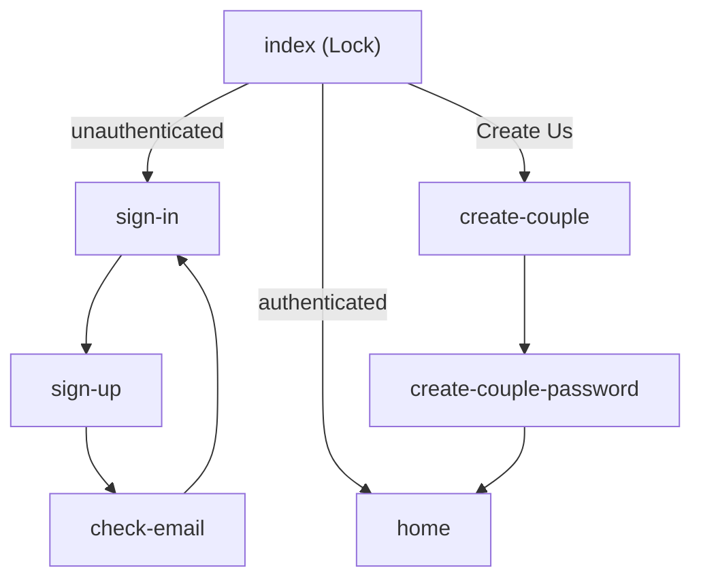

# App Folder Structure — UsOS

This document describes the organization of the `app/` directory in the UsOS React Native (Expo) project. The structure uses **Expo Router** file-based routing with **route groups** for maintainability.

---

## Folder Tree

```
app/
├── _layout.tsx              # Root layout (Stack, ThemeProvider)
├── +html.tsx                # Web HTML template
├── +not-found.tsx           # 404 handler
├── index.tsx                # Entry point + lock screen (auth gate)
│
├── (auth)/                  # Authentication flow
│   ├── _layout.tsx          # Shared auth layout (headerShown: false)
│   ├── sign-in.tsx
│   ├── sign-up.tsx
│   └── check-email.tsx
│
├── (onboarding)/            # Create Us flow
│   ├── _layout.tsx          # Shared onboarding layout
│   ├── create-couple.tsx
│   └── create-couple-password.tsx
│
└── (app)/                   # Authenticated app screens
    ├── _layout.tsx          # Shared app layout
    └── home.tsx
```

---

## Purpose of Each File and Group

### Root Files

| File | Purpose |
|------|---------|
| `_layout.tsx` | Root layout wrapping the app with ThemeProvider, Stack navigator, and PortalHost |
| `+html.tsx` | HTML template for web builds |
| `+not-found.tsx` | Renders when no route matches |
| `index.tsx` | Entry point; shows lock screen when authenticated, redirects to sign-in when not |

### (auth) — Authentication Flow

Screens for signing in, signing up, and email confirmation. URLs: `/sign-in`, `/sign-up`, `/check-email`.

| File | Purpose |
|------|---------|
| `sign-in.tsx` | Email/password sign in |
| `sign-up.tsx` | Account creation with email confirmation |
| `check-email.tsx` | Post-signup screen instructing user to verify email |

### (onboarding) — Create Us Flow

Screens for creating a couple space and optionally setting a couple key. URLs: `/create-couple`, `/create-couple-password`.

| File | Purpose |
|------|---------|
| `create-couple.tsx` | Create a new couple space (name input) |
| `create-couple-password.tsx` | Set optional couple key / passcode |

### (app) — Authenticated App Screens

Screens accessible after authentication. URL: `/home`.

| File | Purpose |
|------|---------|
| `home.tsx` | Main home screen (placeholder for MVP features) |

---

## Navigation Flow



---

## Expo Router Conventions Used

### Route Groups

Parentheses `()` create **route groups** that organize files without changing the URL path:

- `app/(auth)/sign-in.tsx` → `/sign-in` (not `/auth/sign-in`)
- `app/(onboarding)/create-couple.tsx` → `/create-couple`
- `app/(app)/home.tsx` → `/home`

### Special Files

- **`_layout.tsx`** — Defines layout for a route segment (Stack, Tabs, etc.). Renders before child routes.
- **`index.tsx`** — Default route for a directory (e.g. `app/index.tsx` → `/`).
- **`+html.tsx`** — Custom HTML template for web.
- **`+not-found.tsx`** — 404 fallback (the `+` prefix denotes a special file).

---

## Guidelines for Adding New Screens

1. **Auth-related** (login, forgot password, etc.) → `app/(auth)/`
2. **Onboarding** (join couple, invite flow, etc.) → `app/(onboarding)/`
3. **Main app** (photos, letters, notes, calendar, settings) → `app/(app)/`

For new main app features, add files under `app/(app)/`, e.g.:

- `app/(app)/photos.tsx` → `/photos`
- `app/(app)/letters.tsx` → `/letters`
- `app/(app)/settings.tsx` → `/settings`

When the app grows, consider nested layouts (e.g. `(app)/(tabs)/` for tab-based navigation).
